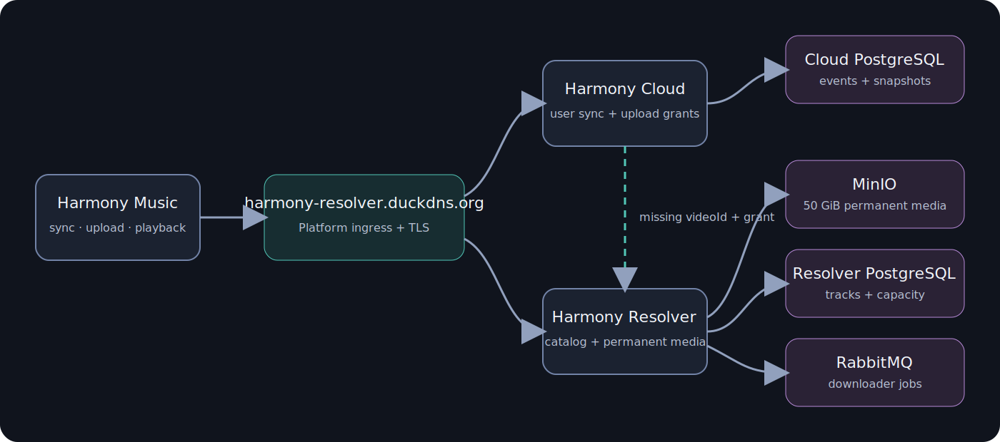
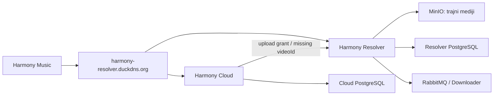

# Harmony trajna pohrana, Cloud backup i prefetch

## Sažetak

- MinIO postaje trajna globalna pohrana pjesama, a PostgreSQL njihov katalog; pjesme više ne istječu.
- Limit medija je 50 GiB: prefetch staje na 45 GiB, backup upload na 48 GiB, urgentni playback na 50 GiB.
- Harmony Music lokalno sprema oko 5 sekundi sljedećih 1–3 pjesama i serveru šalje sljedeća 3 `videoId`-a za prefetch.
- Novi `bozmund/Harmony-Cloud` repo i `Harmony.Cloud.slnx` sinkroniziraju korisničke podatke.
- Novi `bozmund/Harmony-Platform` repo upravlja cijelim VPS stackom i deploymentom.
- Svi servisi koriste postojeći `https://harmony-resolver.duckdns.org` hostname.

## Implementacija

### Harmony Resolver

- Migrirati postojeće ready zapise na `expires_at = null`, ukloniti expiry janitor i onemogućiti MinIO lifecycle brisanje verificiranih medija.
- Dodati canonical metadata pjesme: `videoId`, naslov, izvođač, trajanje, format, veličina i artwork. Object upload mora završiti prije oznake `ready`.
- Uvesti atomske capacity reservations:

  - ispod 45 GiB: prefetch, backup i urgentni ingest;
  - 45–48 GiB: backup i urgentni ingest;
  - 48–50 GiB: samo urgentni ingest;
  - na 50 GiB: odbiti svaki novi objekt, ali uvijek posluživati postojeće.

- Prioritet poslova: urgentni playback > verificiranje backupa > server prefetch. Ponovni zahtjev za reprodukciju promovira postojeći pending posao.
- Dodati `POST /resolver/v1/prefetch` s najviše tri validna YouTube ID-a. Radi za anonimne i prijavljene korisnike, deduplicira postojeće poslove i primjenjuje postojeće ingestion limite.
- Dodati interni M2M endpoint za jednokratni backup grant te capability-token upload endpoint. Resolver ne prima niti pohranjuje korisnički identitet.
- Backup audio prihvatiti samo ako Resolver još nema pjesmu, ID je valjan, datoteka je do 50 MiB i trajanje do 9 minuta.
- Upload držati privremeno, normalizirati ga u canonical Ogg/Opus i verificirati:

  - trajanje mora odgovarati izvoru unutar `max(2 sekunde, 1%)`;
  - usporediti dva Chromaprint segmenta od 15 sekundi, približno na 20% i 60% pjesme;
  - oba segmenta moraju postići najmanje 85% normalizirane sličnosti;
  - source worker dohvaća samo potrebne segmente, ne cijelu pjesmu;
  - neuspješan ili nepotvrđen upload briše se i nikada ne postaje globalan.

  FFmpeg build mora imati Chromaprint podršku, koju FFmpeg službeno omogućuje preko `--enable-chromaprint`. [FFmpeg dokumentacija](https://www.ffmpeg.org/general.html)

- Artwork i verificirani audio ostaju globalni i nisu povezani s korisničkim računom.

### Harmony Cloud

- Kreirati zaseban repo `bozmund/Harmony-Cloud`, .NET 10 solution `Harmony.Cloud.slnx`, API, unit i integration test projekte.
- Koristiti zasebnu `harmony_cloud` PostgreSQL bazu na zajedničkom PostgreSQL serveru. Cloud ne sprema audio.
- Auth0 subject odmah pretvarati u HMAC account ID; ne spremati raw subject, tokene ili credentials.
- Uvesti API:

  - `POST /cloud/v1/devices/register`;
  - `POST /cloud/v1/sync` s checkpointom i batchom događaja;
  - `POST /cloud/v1/audio/next` koji vraća najviše jedan nedostajući audio upload grant;
  - `POST /cloud/v1/sync/pause`;
  - `DELETE /cloud/v1/account`.

- Sync događaj sadrži `eventId`, `deviceId`, lokalni sequence, hybrid-logical timestamp, entity type/ID, operaciju, payload i schema version. Cloud dodjeljuje monotoni server revision.
- Konflikte spajati po zapisu:

  - favoriti i kolekcije koriste add/remove događaje i tombstoneove;
  - settings se spajaju po pojedinačnom ključu;
  - playlist stavke imaju stabilan ID, poredak i tombstone;
  - history i search događaji se dedupliciraju;
  - queue/session koristi zadnju logičku verziju.

- Cijelu povijest čuvati bez isteka dok račun postoji. Snapshoti služe za brzo učitavanje, ali raw history ostaje.
- Opt-out samo pauzira sync. `Delete cloud data/account` briše sve Cloud podatke, uređaje i povijest; globalni Resolver audio ostaje.
- Cloud provjerava koji `videoId` nedostaje i izdaje samo jedan aktivan upload grant. Nema dnevne korisničke kvote.

### Harmony Music

- Zadržati postojeći ručni `.hmb` Backup/Restore.
- Nakon logina prikazati jednokratni Cloud opt-in prompt. Ako korisnik odbije, opcija ostaje dostupna u Settingsu; opt-out kasnije samo pauzira servis.
- Dodati Hive outbox i sync-state tablice. Offline promjene ostaju u outboxu do potvrde; Cloud čuva trajnu povijest, dok lokalni potvrđeni eventi mogu biti compactirani u checkpoint.
- Sinkronizirati isti korisnički rezultat kao sigurni logički backup:

  - downloads i njihov status;
  - favorite, recent i import-review kolekcije;
  - playliste, redoslijed i blacklist;
  - albume, izvođače, search history i lyrics;
  - queue/playback session;
  - sve prenosive postavke.

- Ne slati stream URL cache, home/cache podatke, lokalne putanje, visitor ID, Auth0/Piped credentials, resolver overrideove ili druge tajne.
- Pri prvom syncu spojiti lokalne i Cloud podatke bez automatskog brisanja. Novi uređaj može ponovno preuzeti offline pjesme iz Resolvera.
- Audio backup pokretati samo na Wi-Fi mreži i kad je baterija iznad 50%. Slati strogo jednu datoteku odjednom, podržati nastavak prekinutog uploada i omogućiti ručno pokretanje.
- Nuditi samo postojeće lokalne datoteke s validnim YouTube ID-em koje Resolver još nema.
- Na promjenu queuea serveru poslati sljedeća tri ID-a. Lokalni preload ostaje privremen, cilja približno 5 sekundi i koristi korisnikov raspon 1–3 pjesme.
- Sve Resolver i Cloud pozive koristiti sa zajedničkim hostnameom i postojećim Auth0 audienceom `https://harmony-resolver`.

### Harmony Platform

- Kreirati `bozmund/Harmony-Platform` kao infrastructure repo bez .NET solutiona. Ne uvoditi `Harmony.Shared` runtime solution; servisi dijele versionirani OpenAPI ugovor i generirane klijente.
- Premjestiti ownership nad Composeom, Nginxom, certifikatima, PostgreSQLom, MinIOm, Valkeyjem, RabbitMQom i observabilityjem iz Resolver repoa u Platform.
- Sačuvati postojeće Docker volumene tijekom migracije i napraviti automatizirani backup prije cutovera.
- Nginx rute:

  - `/resolver/*` → Resolver;
  - `/cloud/*` → Harmony Cloud.

- RabbitMQ TLS cert mora vrijediti za `harmony-resolver.duckdns.org`; lokalni downloader koristi isti hostname na portu 5671.
- Resolver i Cloud workflowi testiraju i objavljuju immutable GHCR image te dispatchaju Platform deployment. Samo Platform action SSH-om mijenja produkciju, pokreće migracije, health check i rollback.
- Platform action automatski ažurira DuckDNS IP, obnavlja TLS i deploya bez ručnih VPS naredbi.
- Auth0 koristi postojeći zajednički audience `https://harmony-resolver`, user JWT za oba API-ja te odvojene M2M permissione za downloader ingest i Cloud backup grant.

## Testiranje i rollout

- Resolver testovi: permanent retention, range playback, capacity granice, konkurentne reservations, prioriteti, prefetch deduplikacija, upload limiti i fingerprint match/mismatch.
- Cloud testovi: dva offline uređaja, krivi sat uređaja, idempotentni eventi, playlist konflikti, tombstoneovi, opt-out i potpuno brisanje računa.
- Flutter testovi: sanitizacija sync podataka, offline outbox, prvi merge, settings, Wi-Fi/battery gating, sekvencijalni upload, 5-sekundni preload i server prefetch.
- End-to-end test: korisnik A šalje nedostajuću pjesmu, worker provjeri samo kratke source segmente, Resolver je označi ready, a korisnik B je reproducira range requestom bez punog downloader preuzimanja.
- Posebno testirati krivi audio pod valjanim ID-em, prekid uploada, istovremeni upload iste pjesme te ponašanje na 45/48/50 GiB.
- Rollout redom: Platform i novi hostname, Resolver storage/prefetch, Harmony Cloud, zatim Music sync. Feature flagovi se uključuju tek nakon production smoke testa.

## Pretpostavke i potrebni jednokratni koraci

- 50 GB znači 50 GiB ukupnih trajnih media objekata; PostgreSQL metadata nije dio tog limita.
- Sve verificirane pjesme ostaju trajno, bez automatskog evictiona.
- Resolver nema user ownership ni user provenance.
- Postojeći `harmony-resolver.duckdns.org` ostaje javni hostname za Resolver i Cloud.
- Potrebno je jednom rezervirati `harmony-api` naziv u DuckDNS-u; njihov službeni API automatizira ažuriranje postojećeg DNS zapisa, ali ne dokumentira registraciju novog naziva. [DuckDNS API specifikacija](https://www.duckdns.org/spec.jsp)
- Potrebno je jednokratno dodati DuckDNS, Auth0, GHCR i postojeće VPS deploy tajne u GitHub Environments; nakon toga provisioning i deploy izvršavaju isključivo Actions workflowi.
